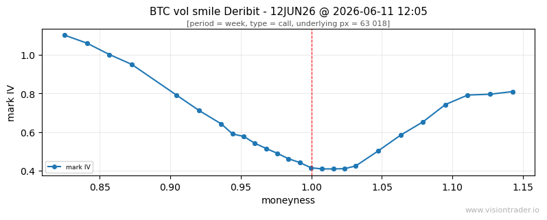
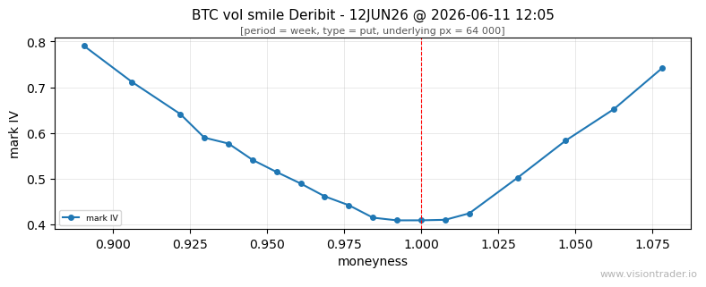
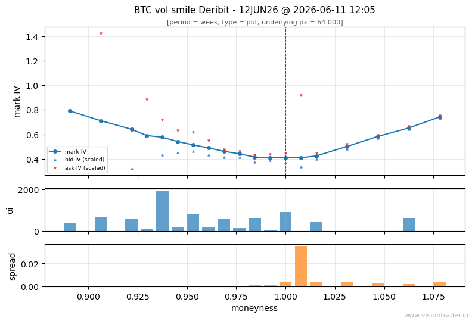

# visiontrader-python

VisionTrader is a quantitative research toolkit for cryptocurrency options markets.

Historical options data is available five minutes after market events occur.

Analyze volatility smiles, term structures, open interest, and option market dynamics directly from pandas DataFrames.

**Why VisionTrader:**
- Deribit options and L2 exchange data history since 2021
- Access to current and historical data in a unified format
- Option boards returned directly as Pandas DataFrames
- Exchange-normalized implied volatility values
- Designed for Jupyter notebooks and quantitative research
- Built for volatility smile and term structure analysis
- Consistent cross-exchange data model

## Install

From source (requires Python 3.10+):

```bash
git clone https://github.com/visiontrader/visiontrader-python.git
cd visiontrader-python
pip install -e ".[dev]"
pytest
```

## Quickstart

The library requires access to the REST API at `http://localhost:5259` (production endpoint TBD). **matplotlib** is needed for `plot_smile` (already included if you ran `pip install -e ".[dev]"` above; otherwise `pip install -e ".[plots]"`).

In Jupyter, enable inline plotting once (if your environment does not already):

```python
%matplotlib inline
```

**Import the SDK and create the options client.**

In [1]:

```python
import pandas as pd
import visiontrader as vt
from visiontrader.plots import plot_smile
vt_options = vt.VisionOptionsClient()
```

**Optionally, register and set up for a free API key** at [www.visiontrader.io](https://www.visiontrader.io) for extended access. You can skip this step. Initial requests can be made without registration, though the number of requests is limited. Please keep this in mind.

In [2]:

```python
vt.setup_key(api_key_id="key_t8Kw3Nmj", secret_key="vt_sk_live_q0zfM9xRGjzFViU1K1xVI8qeVcZn6vxdYKNKx8HD5xg")
# You will need to log in so the client uses the new key
vt_options.login()
```
<small>
✓ Secret key saved to ~/.visiontrader/auth_keys/key_t8Kw3Nmj (permissions 600)

✓ Options client will be using secret key 'vt_sk_live_q0zfM*****' from ~/.visiontrader/auth_keys/key_t8Kw3Nmj</small>

**Fetch a snapshot of the options board and view its main structure.** A snapshot is the full options board at one timestamp; `get_snapshot` returns it as `snap`, a pandas DataFrame where each row is one option leg (call or put) at a given strike. See the [Tutorial](#alternative-snapshot-arguments-expiry-aliases-and-relative-timestamps) for how `next_`* expiry aliases and relative `ts` work.

In [3]:

```python
snap = vt_options.get_snapshot(exchange='deribit', instrument="BTC", expiry="next_weekly", ts="-5m")
snap.loc[:, ['symbol', 'strike', 'moneyness', 'type', 'bid', 'ask', 'markPrice', 'markIv', 'oi']].head(6)
```

```
                symbol   strike  moneyness  type     bid     ask  markPrice  markIv    oi
0  BTC-19JUN26-50000-C  50000.0     0.7882  call  0.2025  0.2205     0.2121  0.6849   NaN
1  BTC-19JUN26-50000-P  50000.0     0.7882   put  0.0001  0.0002     0.0001  0.6848  229.2
2  BTC-19JUN26-53000-C  53000.0     0.8355  call  0.1450  0.1805     0.1650  0.5948   NaN
3  BTC-19JUN26-53000-P  53000.0     0.8355   put  0.0003  0.0004     0.0003  0.5948  607.8
4  BTC-19JUN26-54000-C  54000.0     0.8513  call  0.1300  0.1650     0.1494  0.5679   NaN
5  BTC-19JUN26-54000-P  54000.0     0.8513   put  0.0004  0.0006     0.0005  0.5678  516.4
```

**Plot the vol smile from the snapshot.**

`plot_smile` draws the smile as-is from the raw snapshot — no `filter_for_smile`, no metric panels. The subtitle uses the first row's option type (usually `call`).

In [4]:

```python
plot_smile(snap)
```



<br>

**Filter and customize the snapshot for a put smile:**

1. Keep only `put` options.
2. Recompute moneyness from a custom underlying price (`underlying_price=67000`).
3. Trim the smile wings by moneyness (`min_moneyness=0.80`, `max_moneyness=1.17`).

In [5]:

```python
smile = vt_options.filter_for_smile(snap, 'put', underlying_price = 67000,  min_moneyness = 0.80, max_moneyness = 1.17 )
plot_smile(smile)
```



<br>

**Add open interest, spread, and ask/bid levels** — `oi` and `spread` panels below the smile, plus `askbid` markers on the main chart (ask/bid IV via naive scaling from mark price).

In [6]:

```python
plot_smile(smile, with_metrics=['oi', 'spread', 'askbid'])
```



## Tutorial

Connect to your API (default: `http://localhost:5259`, or set `VT_API_BASE_URL`).

Example session (as in a Jupyter notebook; sample output from a live API).

Import dependencies and create the options client (`VisionOptionsClient` connects to the API; default is local, or pass `base_url` / set `VT_API_BASE_URL`).

In [1]:

```python
from datetime import date, datetime, timezone
import pandas as pd
from visiontrader import VisionOptionsClient
vision_options = VisionOptionsClient()  # VisionOptionsClient(base_url='https://api.example.com')
```

  


**List exchanges that provide options data** (the client requests only the options-capable subset).

In [2]:

```python
vision_options.list_exchanges()
```

```python
['deribit']
```

  


**Getting list symbols with option boards on Deribit** — not the exchange’s full instrument list, only names where historical options data is available.

In [3]:

```python
vision_options.list_instruments('deribit')
```

```python
[
    'AVAX_USDC',
    'BTC',
    'BTC_USDC',
    'ETH',
    'ETH_USDC',
    'SOL',
    'SOL_USDC',
    'TRX_USDC',
    'XRP_USDC',
]
```

  


**Fetch expiry dates and settlement period types for BTC** (`tail` shows the last rows when the list is long).

In [4]:

```python
vision_options.list_expiries('deribit', 'BTC').tail(22).reset_index(drop=True)
```

```
       expiry settlement_period
0  2026-05-29             month
1  2026-05-30               day
2  2026-05-31               day
3  2026-06-01               day
4  2026-06-02               day
5  2026-06-03               day
6  2026-06-04               day
7  2026-06-05              week
8  2026-06-06               day
9  2026-06-07               day
10 2026-06-08               day
11 2026-06-09               day
12 2026-06-10               day
13 2026-06-11               day
14 2026-06-12              week
15 2026-06-19              week
16 2026-06-26             month
17 2026-07-31             month
18 2026-08-28             month
19 2026-09-25             month
20 2026-12-25             month
21 2027-03-26             month
```

  


**Show calendar dates on which snapshot data exists for the selected expiry.**

In [5]:

```python
vision_options.list_dates('deribit', 'BTC', '2026-06-04')
```

```
   available dates
0    2026-05-31
1    2026-06-01
2    2026-06-02
3    2026-06-03
4    2026-06-04
```

  


**Load a single options board at a given timestamp.** Returns a DataFrame: snapshot fields (`exchange`, `underlying`, `expiry`, `ts`, `underlyingPrice`) on every row, plus strike-level `moneyness` (`strike / underlyingPrice`), bid/ask, mark, IV, and OI.

In [6]:

```python
snap = vision_options.get_snapshot('BTC', '2026-06-04', '2026-06-03T12:00')
snap.head(6)
```

```
   exchange underlying      expiry                        ts  underlyingPrice              symbol  strike  moneyness  type     bid     ask  markPrice  markIv    oi
0   deribit       BTC  2026-06-04 2026-06-03 12:00:00+00:00         66948.82  BTC-4JUN26-61000-C   61000     0.9111  call  0.0845  0.0940     0.0889  0.8781   NaN
1   deribit       BTC  2026-06-04 2026-06-03 12:00:00+00:00         66948.82  BTC-4JUN26-61000-P   61000     0.9111   put  0.0001  0.0003     0.0002  0.8780  79.1
2   deribit       BTC  2026-06-04 2026-06-03 12:00:00+00:00         66948.82  BTC-4JUN26-62000-C   62000     0.9261  call  0.0700  0.0790     0.0741  0.8335   0.2
3   deribit       BTC  2026-06-04 2026-06-03 12:00:00+00:00         66948.82  BTC-4JUN26-62000-P   62000     0.9261   put  0.0003  0.0005     0.0004  0.8335  38.2
4   deribit       BTC  2026-06-04 2026-06-03 12:00:00+00:00         66948.82  BTC-4JUN26-63000-C   63000     0.9410  call  0.0555  0.0640     0.0595  0.7652   NaN
5   deribit       BTC  2026-06-04 2026-06-03 12:00:00+00:00         66948.82  BTC-4JUN26-63000-P   63000     0.9410   put  0.0006  0.0008     0.0007  0.7652  92.3
```

  


### Alternative snapshot arguments (expiry aliases and relative timestamps)

Besides explicit dates and RFC3339 times, `get_snapshot` accepts semantic shortcuts — the same style as in the Quickstart.

**Fetch the nearest weekly options board on Deribit.** In `next_weekly`, `next` picks the closest tradeable expiry and `weekly` restricts it to the week settlement period.

Supported expiry aliases:

- `next_daily` — daily board with the nearest expiration
- `next_weekly` — weekly board with the nearest expiration
- `next_monthly` — monthly board with the nearest expiration
- `next_quarterly` — quarterly board with the nearest expiration

Each alias is resolved from `list_expiries`: the SDK looks for the nearest expiry on or after tomorrow (UTC) with the matching `settlement_period` (`day`, `week`, `month`, or `quarter`).

**Relative `ts`.** Pass a string like `-5m`, `-1h`, or `-1d`: the SDK subtracts that offset from the current UTC time before calling the API. Supported units are minutes (`m`), hours (`h`), and days (`d`); seconds are not supported. Unsigned or forward offsets (e.g. `5m`) are rejected. You can still pass an absolute timestamp as a `datetime` or ISO-8601 string (as in In [6] above).

In [7]:

```python
snap = vision_options.get_snapshot(exchange='deribit', instrument='BTC', expiry='next_weekly', ts='-5m')
```

*In the beta release, this request can take more than 1.5 minutes.*

  


**Filter by moneyness** to see how far each leg is from at-the-money (`moneyness ≈ 1.0`). The column is computed in the SDK — filter by moneyness, not by absolute strikes, to keep only legs near ATM on any board.

In [8]:

```python
snap.loc[snap['moneyness'].between(0.98, 1.02), ['symbol', 'type', 'strike', 'underlyingPrice', 'moneyness', 'markIv']]
```

```
              symbol  type  strike  underlyingPrice  moneyness  markIv
26  BTC-4JUN26-66000-C  call   66000         66948.82     0.9844  0.5746
27  BTC-4JUN26-66000-P   put   66000         66948.82     0.9844  0.5746
28  BTC-4JUN26-66500-C  call   66500         66948.82     0.9933  0.5416
29  BTC-4JUN26-66500-P   put   66500         66948.82     0.9933  0.5416
30  BTC-4JUN26-67000-C  call   67000         66948.82     1.0008  0.5102
31  BTC-4JUN26-67000-P   put   67000         66948.82     1.0008  0.5102
32  BTC-4JUN26-67500-C  call   67500         66948.82     1.0082  0.4905
33  BTC-4JUN26-67500-P   put   67500         66948.82     1.0082  0.4905
34  BTC-4JUN26-68000-C  call   68000         66948.82     1.0156  0.4685
35  BTC-4JUN26-68000-P   put   68000         66948.82     1.0156  0.4685
```

  


**Manually plot the volatility smile from the same snapshot.** On Deribit `markIv` is the same per strike for calls and puts — one line per strike is enough.

Requires `matplotlib` (usual in Jupyter: `pip install matplotlib`).

In [9]:

```python
import matplotlib.pyplot as plt

smile = (
    snap.loc[snap['type'] == 'call']
    .dropna(subset=['markIv'])
    .loc[lambda df: df['moneyness'] <= 1.13]
    .sort_values('moneyness')
)

fig, ax = plt.subplots(figsize=(8, 3.5))
ax.plot(smile['moneyness'], smile['markIv'], 'o-', label='mark IV', markersize=4)
ax.axvline(1.0, color='red', linestyle='--', linewidth=0.8)
ax.set_xlabel('moneyness')
ax.set_ylabel('mark IV')
ax.set_title('BTC vol smile — Deribit 4JUN26 @ 2026-06-03 12:00 UTC')
ax.grid(True, which='major', linestyle='-', linewidth=0.5, alpha=0.4)
ax.legend()
plt.tight_layout()
plt.savefig('vol_smile.png', dpi=150)
plt.show()
```


*Why `moneyness ≤ 1.13`? Past ~1.14, `markIv` plateaus (~0.85) while quotes vanish on calls — Deribit mark extrapolation, not market smile. The filter keeps the liquid part of the curve.*

## API coverage (v0.1)


| Method                                                                                     | HTTP                                          |
| ------------------------------------------------------------------------------------------ | --------------------------------------------- |
| `list_exchanges()`                                                                         | `GET /exchanges?type=options`                 |
| `list_instruments(exchange)`                                                               | `GET options/instruments`                     |
| `list_expiries(exchange, instrument, tradeable_only=...)`                                  | `GET options/expiries` → DataFrame            |
| `list_dates(exchange, instrument, expiry)`                                                 | `GET options/dates` → DataFrame               |
| `get_snapshot(...)`                                                                        | `GET /options/snapshot` → DataFrame           |
| `filter_for_smile(snap, type, min_moneyness=..., max_moneyness=..., underlying_price=...)` | filter snapshot → smile-ready DataFrame       |
| `get_snapshots(..., on_date=...)`                                                          | `GET /options/snapshots`                      |
| `snapshots_to_dataframe(...)`                                                              | `GET /options/snapshots` → DataFrame          |
| `plot_smile(smile, with_metrics=...)`                                                      | vol smile plot → `(fig, ax)` or `(fig, axes)` |


Query parameter for the board instrument is `**instrument*`*.

`get_snapshot` defaults to `exchange='deribit'`, accepts expiry aliases
(`next_daily`, `next_weekly`, `next_monthly`, `next_quarterly`) and relative timestamps
(`-4m`, `-1h`, `-1d`, case-insensitive units).

## Backend

Requires a running [VT.AspNetApp](https://github.com/visiontrader) REST API and its gRPC data layer.

## License

MIT — see [LICENSE](LICENSE).