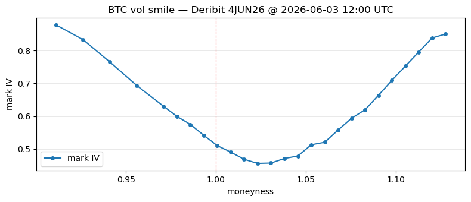

# visiontrader-python

VisionTrader is a quantitative research toolkit for cryptocurrency options markets.

Historical options data is available five minutes after market events occur.

Analyze volatility smiles, term structures, open interest, and option market dynamics directly from Pandas DataFrames.

**Why VisionTrader:**

- Option boards returned directly as Pandas DataFrames
- Exchange-normalized implied volatility values
- Designed for Jupyter notebooks and quantitative research
- Built for volatility smile and term structure analysis
- Consistent cross-exchange data model

## Install

From source (requires Python 3.10+):

```bash
git clone https://github.com/visiontrader/visiontrader-python.git
cd visiontrader-python
pip install -e ".[dev]"
pytest
```

**pandas** is a core dependency (installed automatically):

```python
import pandas as pd
```

## Quickstart

Requires a running VT.AspNetApp API and plotting extras:

```bash
pip install -e ".[plots]"
```

In Jupyter, enable inline plotting once (if your environment does not already):

```python
%matplotlib inline
```

In [1]:

```python
from visiontrader import VisionOptionsClient
from visiontrader.plots import plot_smile

vt = VisionOptionsClient()
snap = vt.get_snapshot(instrument="BTC", expiry="next_daily", ts="-4m")
smile = vt.get_smile(snap, 'call')
plot_smile(smile)
```

## Tutorial

Connect to your API (default: `http://localhost:5259`, or set `VT_API_BASE_URL`).

Example session (as in a Jupyter notebook; sample output from a live API).

Import dependencies and create the options client (`VisionOptionsClient` connects to the API; default is local, or pass `base_url` / set `VT_API_BASE_URL`).

In [1]:

```python
from datetime import date, datetime, timezone
import pandas as pd
from visiontrader import VisionOptionsClient
vision_options = VisionOptionsClient()  # VisionOptionsClient(base_url='https://api.example.com')
```
<br>

**List exchanges that provide options data** (the client requests only the options-capable subset).

In [2]:

```python
vision_options.list_exchanges()
```

```python
['deribit']
```
<br>

**Getting list symbols with option boards on Deribit** — not the exchange’s full instrument list, only names where historical options data is available.

In [3]:

```python
vision_options.list_instruments('deribit')
```

```python
[
    'AVAX_USDC',
    'BTC',
    'BTC_USDC',
    'ETH',
    'ETH_USDC',
    'SOL',
    'SOL_USDC',
    'TRX_USDC',
    'XRP_USDC',
]
```
<br>

**Fetch expiry dates and settlement period types for BTC** (`tail` shows the last rows when the list is long).

In [4]:

```python
vision_options.list_expiries('deribit', 'BTC').tail(22).reset_index(drop=True)
```

```
       expiry settlement_period
0  2026-05-29             month
1  2026-05-30               day
2  2026-05-31               day
3  2026-06-01               day
4  2026-06-02               day
5  2026-06-03               day
6  2026-06-04               day
7  2026-06-05              week
8  2026-06-06               day
9  2026-06-07               day
10 2026-06-08               day
11 2026-06-09               day
12 2026-06-10               day
13 2026-06-11               day
14 2026-06-12              week
15 2026-06-19              week
16 2026-06-26             month
17 2026-07-31             month
18 2026-08-28             month
19 2026-09-25             month
20 2026-12-25             month
21 2027-03-26             month
```
<br>

**Show calendar dates on which snapshot data exists for the selected expiry.**

In [5]:

```python
vision_options.list_dates('deribit', 'BTC', '2026-06-04')
```

```
   available dates
0    2026-05-31
1    2026-06-01
2    2026-06-02
3    2026-06-03
4    2026-06-04
```
<br>

**Load a single options board at a given timestamp.** Returns a DataFrame: snapshot fields (`exchange`, `underlying`, `expiry`, `ts`, `underlyingPrice`) on every row, plus strike-level `moneyness` (`strike / underlyingPrice`), bid/ask, mark, IV, and OI.

In [6]:

```python
snap = vision_options.get_snapshot('BTC', '2026-06-04', '2026-06-03T12:00')
snap.head(6)
```

```
   exchange underlying      expiry                        ts  underlyingPrice              symbol  strike  moneyness  type     bid     ask  markPrice  markIv    oi
0   deribit       BTC  2026-06-04 2026-06-03 12:00:00+00:00         66948.82  BTC-4JUN26-61000-C   61000     0.9111  call  0.0845  0.0940     0.0889  0.8781   NaN
1   deribit       BTC  2026-06-04 2026-06-03 12:00:00+00:00         66948.82  BTC-4JUN26-61000-P   61000     0.9111   put  0.0001  0.0003     0.0002  0.8780  79.1
2   deribit       BTC  2026-06-04 2026-06-03 12:00:00+00:00         66948.82  BTC-4JUN26-62000-C   62000     0.9261  call  0.0700  0.0790     0.0741  0.8335   0.2
3   deribit       BTC  2026-06-04 2026-06-03 12:00:00+00:00         66948.82  BTC-4JUN26-62000-P   62000     0.9261   put  0.0003  0.0005     0.0004  0.8335  38.2
4   deribit       BTC  2026-06-04 2026-06-03 12:00:00+00:00         66948.82  BTC-4JUN26-63000-C   63000     0.9410  call  0.0555  0.0640     0.0595  0.7652   NaN
5   deribit       BTC  2026-06-04 2026-06-03 12:00:00+00:00         66948.82  BTC-4JUN26-63000-P   63000     0.9410   put  0.0006  0.0008     0.0007  0.7652  92.3
```
<br>

**Filter by moneyness** to see how far each leg is from at-the-money (`moneyness ≈ 1.0`). The column is computed in the SDK — filter by moneyness, not by absolute strikes, to keep only legs near ATM on any board.

In [7]:

```python
snap.loc[snap['moneyness'].between(0.98, 1.02), ['symbol', 'type', 'strike', 'underlyingPrice', 'moneyness', 'markIv']]
```

```
              symbol  type  strike  underlyingPrice  moneyness  markIv
26  BTC-4JUN26-66000-C  call   66000         66948.82     0.9844  0.5746
27  BTC-4JUN26-66000-P   put   66000         66948.82     0.9844  0.5746
28  BTC-4JUN26-66500-C  call   66500         66948.82     0.9933  0.5416
29  BTC-4JUN26-66500-P   put   66500         66948.82     0.9933  0.5416
30  BTC-4JUN26-67000-C  call   67000         66948.82     1.0008  0.5102
31  BTC-4JUN26-67000-P   put   67000         66948.82     1.0008  0.5102
32  BTC-4JUN26-67500-C  call   67500         66948.82     1.0082  0.4905
33  BTC-4JUN26-67500-P   put   67500         66948.82     1.0082  0.4905
34  BTC-4JUN26-68000-C  call   68000         66948.82     1.0156  0.4685
35  BTC-4JUN26-68000-P   put   68000         66948.82     1.0156  0.4685
```
<br>

**Plot the volatility smile from the same snapshot**. On Deribit `markIv` is the same per strike for calls and puts — one line per strike is enough.

Requires `matplotlib` (usual in Jupyter: `pip install matplotlib`).

In [8]:

```python
import matplotlib.pyplot as plt

smile = (
    snap.loc[snap['type'] == 'call']
    .dropna(subset=['markIv'])
    .loc[lambda df: df['moneyness'] <= 1.13]
    .sort_values('moneyness')
)

fig, ax = plt.subplots(figsize=(8, 3.5))
ax.plot(smile['moneyness'], smile['markIv'], 'o-', label='mark IV', markersize=4)
ax.axvline(1.0, color='red', linestyle='--', linewidth=0.8)
ax.set_xlabel('moneyness')
ax.set_ylabel('mark IV')
ax.set_title('BTC vol smile — Deribit 4JUN26 @ 2026-06-03 12:00 UTC')
ax.grid(True, which='major', linestyle='-', linewidth=0.5, alpha=0.4)
ax.legend()
plt.tight_layout()
plt.savefig('vol_smile.png', dpi=150)
plt.show()
```



<small><em>Why trim the right wing (`moneyness &lt;= 1.13`)? Beyond that point the curve in the raw API data stops behaving like a market smile and flattens into a plateau. From strike 76500 onward (moneyness ≈ 1.14+) `markIv` is stuck at ~0.8505 while moneyness keeps increasing — seven strikes in a row, identical IV. On the call side those legs have no real market: `bid` is null, `ask` is the minimum tick (0.0001), `markPrice` is 0 or null. Puts at the same strikes still have a rising `markPrice`, but Deribit assigns the same capped `markIv` per strike. That pattern is typical of mark-model extrapolation / IV ceiling on illiquid deep OTM wings, not tradeable skew. Trimming keeps the chart focused on the liquid part of the board where IV actually varies with moneyness. For analysis of the full raw board, drop the filter and inspect `markPrice` and quotes alongside `markIv`.</em></small>


## API coverage (v0.1)

| Method | HTTP |
|--------|------|
| `list_exchanges()` | `GET /exchanges?type=options` |
| `list_instruments(exchange)` | `GET options/instruments` |
| `list_expiries(exchange, instrument, tradeable_only=...)` | `GET options/expiries` → DataFrame |
| `list_dates(exchange, instrument, expiry)` | `GET options/dates` → DataFrame |
| `get_snapshot(...)` | `GET /options/snapshot` → DataFrame |
| `get_smile(snap, type, min=0.9, max=1.13)` | snapshot → smile DataFrame |
| `get_snapshots(..., on_date=...)` | `GET /options/snapshots` |
| `snapshots_to_dataframe(...)` | `GET /options/snapshots` → DataFrame |
| `plot_smile(smile)` | vol smile plot → `(fig, ax)` (`visiontrader.plots`) |

Query parameter for the board instrument is **`instrument`**.

`get_snapshot` defaults to `exchange='deribit'`, accepts expiry aliases
(`next_daily`, `next_weekly`, `next_monthly`, `next_quarterly`) and relative timestamps
(`-4m`, `-1h`, `-1d`, case-insensitive units).

## Backend

Requires a running [VT.AspNetApp](https://github.com/visiontrader) REST API and its gRPC data layer.

## License

MIT — see [LICENSE](LICENSE).
